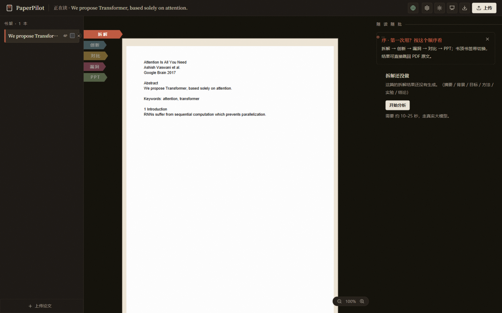

# PaperPilot

一个论文阅读辅助工具。上传 PDF 或 Word 论文，大模型帮你做结构化拆解、相关工作对比、局限性分析，还能一键生成汇报 PPT。

左边看原文，右边看 AI 分析，点击分析里的引用可以跳回原文对应位置。



## 功能

- 支持 PDF / DOCX 上传，自动解析和分页
- 五段式拆解（摘要 / 背景 / 目标 / 方法 / 实验 / 结论），长论文按章节切分并发分析后汇总
- 创新点识别和评级
- 联网搜相关工作生成对比表（默认 arXiv，可换 Tavily），支持论文库内多篇对比
- 从方法、实验、写作三个层面找论文局限性和改进建议
- 生成 8-15 页汇报 PPT
- 暗色模式
- 可以打包成 Windows 桌面应用（Electron，见下文）

LLM 走 OpenAI 兼容接口，DeepSeek / MiniMax / OpenAI / 本地 Ollama 都行，启动后在网页右上角「设置」里填 base_url 和 API Key 就能用，不需要改代码。

## 快速开始

环境要求：Python 3.11+（后端用了 `asyncio.timeout`），Node.js 20+。

**Linux / macOS：**

```bash
# 后端
cd backend
python3 -m venv venv && source venv/bin/activate
pip install -r requirements.txt
cp .env.example .env
uvicorn app.main:app --reload

# 前端（另开一个终端）
cd frontend
cp .env.local.example .env.local
npm install
npm run dev
```

**Windows（PowerShell）：**

```powershell
cd backend
python -m venv venv
.\venv\Scripts\Activate.ps1
pip install -r requirements.txt
copy .env.example .env
uvicorn app.main:app --reload

cd ..\frontend
copy .env.local.example .env.local
npm install
npm run dev
```

打开 http://localhost:3000，先在「设置」里填好 LLM 的 API Key，然后上传论文。

也可以直接跑仓库根目录的 `start_dev.sh` / `start_dev.ps1` 一键启动前后端。

> macOS 上 pip 装依赖失败（Python 3.14 没有预编译 wheel）时，改用 `requirements-mac.txt`。

LLM 配置的详细说明（包括各平台的 base_url 对照）见 [`backend/.env.example`](backend/.env.example) 和 [`USER_GUIDE.md`](USER_GUIDE.md)。

## 桌面版

不想装 Python / Node 的话，可以把前后端打包成一个 Windows 安装包（约 150 MB）：

```powershell
# 后端打成独立 exe
cd backend
py -3.12 -m venv venv
.\venv\Scripts\pip install -r requirements.txt pyinstaller
.\venv\Scripts\pyinstaller paperpilot-backend.spec --noconfirm --clean

# 前端静态导出 + 组装 + 冒烟
cd ..\frontend
npm install
npm run build:desktop
cd ..\desktop
npm install
npm run assemble
npm run smoke

# 出安装包
npm run dist   # desktop/release/PaperPilot Setup x.x.x.exe
```

原理：Electron 启动时拉起打包好的后端进程，FastAPI 同时托管前端静态页面，前后端同源通信。数据（论文库、设置）放在 `%APPDATA%\paperpilot-desktop\`，卸载不会丢。细节见 [`desktop/README.md`](desktop/README.md)。

## 开发

```bash
# 后端测试（260 个用例）和 lint
cd backend
pip install -r requirements.txt -r requirements-dev.txt
python -m pytest tests/ -v
ruff check app tests

# 前端测试、类型检查、lint
cd frontend
npm test
npx tsc --noEmit -p tsconfig.json
npm run lint
```

CI 在 `.github/workflows/ci.yml`，push 和 PR 会自动跑上面这些检查。

接口文档见 [`docs/api-spec.md`](docs/api-spec.md)，技术架构见 [`docs/tech-architecture.md`](docs/tech-architecture.md)，桌面版的设计分析见 [`docs/feasibility-electron-desktop.md`](docs/feasibility-electron-desktop.md)。

## 目录结构

```
├── backend/     # FastAPI 后端：PDF 解析、LLM 调用、Map-Reduce 拆解、PPT 生成
├── frontend/    # Next.js 14 前端：对开视图、pdf.js 渲染、引用跳转
├── desktop/     # Electron 壳：打包成 Windows 桌面应用
└── docs/        # 接口文档、架构文档、历次审查报告
```

## 技术栈

Next.js 14 + TypeScript + Tailwind / FastAPI + Python 3.11 / pdf.js / PyMuPDF / python-pptx / Zustand / Electron + PyInstaller

## 参与贡献

欢迎提 Issue 和 PR，流程见 [`CONTRIBUTING.md`](CONTRIBUTING.md)。行为规范见 [`CODE_OF_CONDUCT.md`](CODE_OF_CONDUCT.md)。

## License

[MIT](LICENSE)
